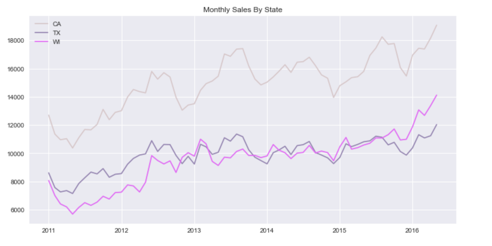

**********************************************
# Wallmart Sales Forecasting
**********************************************

#### Author: Chelsea Zaloumis

*Last update: 3/19/2021*

# Background
---
Based off the M5 Forecasting Kaggle Competition: https://www.kaggle.com/c/m5-forecasting-accuracy/overview

*Can you estimate, as precisely as possible, the point forecasts of the unit sales of various products sold in the USA by Walmart?*

This project helped me better understand time series and forecasting problems.

# Exploration
---
Original data can be found at the kaggle link to the competition above. Data contains item sales by state, which can be drilled down to each state's various stores, departments, and items.

